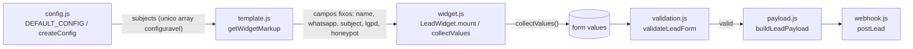

# Implementation Plan

## Request Summary
- Objective: adicionar três novos campos de captura (CNPJ, Razão Social, E-mail) ao formulário de lead e uma opção `config.fields: string[]` que controla presença, ordem e obrigatoriedade (prefixo `"*"`) desses campos e dos já existentes `name`/`whatsapp`, mantendo Nome e WhatsApp sempre presentes/obrigatórios/nas duas primeiras posições.
- Scope: in — novos campos CNPJ/Razão Social/E-mail; `config.fields` (presença+ordem); sintaxe `"*"` para obrigatoriedade; inclusão/omissão condicional de `cnpj`/`razao_social`/`email` no payload do webhook. Out — validação de formato (CNPJ/e-mail); `subject`/`lgpd`/`honeypot` fora do escopo de `config.fields`; comportamento de identificadores desconhecidos (ignorados silenciosamente, não é AC); máscara de input para CNPJ.
- Tier: standard
- Architecture references: AGENTS.md, docs/agents/architecture.md, docs/agents/domain_rules.md, docs/agents/api_contracts.md (contract-boundary check), docs/agents/data_model.md (verified no persistence impact)

## AS IS — Componentes impactados

Hoje `config.js` só expõe `subjects` como array configurável; a ordem e o conjunto de campos do formulário (Nome, WhatsApp, Assunto, LGPD, honeypot) estão hardcoded em `src/ui/template.js:getWidgetMarkup`, e `validateLeadForm`/`buildLeadPayload` não recebem nenhuma noção de "campos dinâmicos".

## TO BE — Componentes propostos

```mermaid
flowchart LR
  Config["config.js<br/>DEFAULT_CONFIG.fields (novo, T02)"] -->|"fields: string[] (CT-01)"| Fields["core/fields.js<br/>resolveFields() (novo, T01)"]
  Fields -->|"lista ordenada + required"| Template["template.js<br/>getWidgetMarkup (alterado, T03)"]
  Fields -->|"lista ordenada + required"| Widget["widget.js<br/>collectValues / submit (alterado, T04)"]
  Template -->|"name, whatsapp sempre 1a/2a posicao<br/>+ cnpj/razaoSocial/email conforme fields"| Widget
  Widget -->|"collectValues() (alterado, T04)"| Values[("form values<br/>+cnpj/razaoSocial/email (novo)")]
  Values --> Validation["validation.js<br/>validateLeadForm (alterado, T05)"]
  Widget -->|"fields (required flags)"| Validation
  Validation -->|valid| Payload["payload.js<br/>buildLeadPayload (alterado, T06)"]
  Widget -->|"fields (payload keys)"| Payload
  Payload --> Webhook["webhook.js<br/>postLead (inalterado)"]
```

`core/fields.js` (T01) é a única fonte de verdade da resolução de identificador→ordem/obrigatoriedade/label/chave-payload, consumida por `template.js` (render, T03) e por `widget.js` (T04), que repassa o resultado para `validation.js` (T05) e `payload.js` (T06) — preservando a regra de camadas (resolução de domínio vive em `core/`, não em `ui/widget.js`).

## Tasks

### T01 — Módulo `core/fields.js` (resolução pura de campos configuráveis)
- **Files**: `src/core/fields.js` (novo)
- **Change**: Exportar `FIELD_DEFINITIONS` — mapa `{ cnpj: { label: 'CNPJ', payloadKey: 'cnpj', errorMessage: 'Informe o CNPJ.' }, razaoSocial: { label: 'Razão Social', payloadKey: 'razao_social', errorMessage: 'Informe a razão social.' }, email: { label: 'E-mail', payloadKey: 'email', errorMessage: 'Informe um e-mail.' } }` — e `resolveFields(fieldsConfig = [])`, que: (1) itera os itens do array na ordem original; (2) para cada item string, remove prefixo `"*"` (marca `required: true`) e resolve o identificador restante; (3) mantém apenas identificadores presentes em `FIELD_DEFINITIONS` (ignora `"name"`, `"whatsapp"` e strings desconhecidas — RF-01/RF-08 tratam esses dois separadamente, fora deste resolver); (4) retorna `[{ id, required }]` preservando a ordem relativa dos itens reconhecidos. Função pura, sem DOM/rede (`core/` architecture rule).
- **Covers**: RF-01, RF-02, RF-03, RF-04, RF-05, RF-06, RF-07 (identificação, ordem e flag `required` — a renderização/validação/payload em si ficam nas tasks seguintes)
- **Tests**: `tests/unit/fields.test.js` — casos: ordem preservada (`["email","cnpj"]` → `[email, cnpj]`); prefixo `"*"` seta `required: true` e remove o caractere do id; item sem `"*"` → `required: false`; `"name"`/`"whatsapp"` sempre ignorados mesmo presentes; identificador desconhecido ignorado silenciosamente; array vazio → `[]`.
- **Risk**: Low — módulo novo, isolado, sem consumidores ainda.
- **Dependencies**: none

### T02 — Novo default `fields: []` em `config.js`
- **Files**: `src/config.js`
- **Change**: Adicionar `fields: []` a `DEFAULT_CONFIG`, seguindo a convenção `camelCase` já usada nas demais chaves (`webhookTimeoutMs`, `honeypotName`). `createConfig(overrides)` já faz merge raso (`{...DEFAULT_CONFIG, ...overrides}`), portanto nenhuma mudança de lógica é necessária ali — apenas o novo valor default.
- **Covers**: CT-01
- **Tests**: `tests/unit/config.test.js` (novo, arquivo mínimo) — `DEFAULT_CONFIG.fields` é `[]`; `createConfig({ fields: ['*cnpj'] }).fields` reflete o override; `createConfig().fields` é `[]` quando merchant não configura nada (comportamento atual preservado).
- **Risk**: Low — campo aditivo, não quebra merges existentes.
- **Dependencies**: none

### T03 — Renderização dinâmica dos campos em `template.js`
- **Files**: `src/ui/template.js`
- **Change**: Importar `resolveFields`, `FIELD_DEFINITIONS` de `../core/fields.js`. Manter o bloco fixo de Nome e WhatsApp inalterado nas duas primeiras posições (RF-08). Substituir a lacuna entre WhatsApp e o bloco de Assunto por um loop sobre `resolveFields(config.fields)`, gerando `<label>${FIELD_DEFINITIONS[id].label}<input name="${id}" ${required ? 'required' : ''} /></label>` para cada entrada, seguindo o padrão estrutural existente (`<label>Texto<input name="..."/></label>`, `src/ui/template.js:31-38`). Blocos de Assunto/LGPD/honeypot permanecem exatamente na mesma posição relativa (logo após o bloco de campos configuráveis), sem mudança de conteúdo.
- **Covers**: RF-01, RF-02, RF-03, RF-04, RF-05, RF-08 (posição fixa de name/whatsapp), UI-01, UI-02
- **Tests**: `tests/unit/template.test.js` (novo, jsdom já configurado em `vitest.config.js`) — `getWidgetMarkup({...config, fields: ['email','cnpj']})` + `createElementFromHtml` produz `form.elements.email`/`form.elements.cnpj` presentes, nessa ordem, após `whatsapp`; `fields: []` não renderiza nenhum dos 3 campos extras; `fields: ['*cnpj']` marca `input[name=cnpj]` com atributo `required`; cada campo extra fica envolvido em `<label>` com o texto esperado (UI-01); ordem final de `form.querySelectorAll('label, input')` mantém Assunto/LGPD/honeypot após o bloco dinâmico (UI-02).
- **Risk**: Medium — altera geração de markup compartilhado; risco de regressão na ordem/posição dos campos fixos (Assunto/LGPD/honeypot) se o loop for inserido no lugar errado.
- **Dependencies**: T01, T02

### T04 — Orquestração em `widget.js` (coleta de valores, validação, payload)
- **Files**: `src/ui/widget.js`
- **Change**: Importar `resolveFields` de `../core/fields.js`. Em `collectValues()`, após os campos fixos existentes, iterar `resolveFields(this.config.fields)` e adicionar `values[id] = this.getField(id)?.value || ''` para cada entrada (campos não renderizados retornam `undefined` de `getField`, tratado com `?.`). Em `submit()`, passar `resolveFields(this.config.fields)` como `options.fields` para `validateLeadForm(values, { subjects: this.config.subjects, fields: resolveFields(this.config.fields) })`, e como `fields` dentro do objeto passado a `buildLeadPayload({ ...values, fields: resolveFields(this.config.fields), origin, sourceUrl, date })`. Nenhuma chamada de rede nova é introduzida (RNF-02) — `resolveFields` é síncrona e pura.
- **Covers**: RF-06, RF-07, RF-09, RF-10, RF-11 (orquestração — decisão de negócio permanece em `core/fields.js`/`validation.js`/`payload.js`), RNF-02
- **Tests**: cobertura via `tests/integration/configurable-fields.spec.js` (T08) — `widget.js` é camada `ui/` orquestradora, seguindo o padrão do repositório de não ter `tests/unit/widget.test.js` dedicado (unit tests mirram `core/`+`integrations/`; orquestração de DOM é validada via Playwright).
- **Risk**: Medium — toca o caminho crítico de submit (webhook + redirect); regressão aqui bloquearia todo o fluxo de lead, não só os campos novos.
- **Dependencies**: T01, T03, T05, T06

### T05 — Validação condicional de obrigatoriedade em `validation.js`
- **Files**: `src/core/validation.js`
- **Change**: Importar `FIELD_DEFINITIONS` de `./fields.js`. Estender a assinatura `validateLeadForm(values, options = {})` para ler `options.fields = []` (array `[{ id, required }]` vindo de `resolveFields`, já resolvido por quem chama). Após as checagens existentes (honeypot → nome → whatsapp → lgpd → assunto, ordem preservada), iterar `options.fields`; para cada entrada com `required === true`, se `String(values[id] || '').trim()` for vazio, setar `errors[id] = FIELD_DEFINITIONS[id].errorMessage`. Entradas com `required === false` não geram erro mesmo vazias (RF-07). Parâmetro `fields` default `[]` preserva 100% do comportamento atual quando omitido (chamadas existentes sem esse argumento continuam funcionando).
- **Covers**: RF-06, RF-07, RF-09
- **Tests**: estender `tests/unit/validation.test.js` — `fields: [{id:'cnpj', required:true}]` com `values.cnpj` vazio/só espaços → `errors.cnpj` definido, `valid === false`; mesmo caso com `required:false` → sem erro; múltiplos campos obrigatórios simultâneos; `fields` omitido (comportamento AS IS) continua passando nos testes existentes.
- **Risk**: Low-Medium — módulo core crítico e já testado; mudança é aditiva (novo loop após checagens existentes), mas precisa preservar a ordem de validação documentada em `domain_rules.md`.
- **Dependencies**: T01

### T06 — Chaves condicionais no payload em `payload.js`
- **Files**: `src/core/payload.js`
- **Change**: Importar `FIELD_DEFINITIONS` de `./fields.js`. Estender `buildLeadPayload(input)` para ler `input.fields = []` (mesmo formato `[{ id, required }]`); após a montagem do payload base (`nome`, `whatsapp`, `origem_trafego`, `url_origem`, `data_hora`, `assunto`/`produto_interesse`+`produto_id`), iterar `input.fields` e setar `payload[FIELD_DEFINITIONS[id].payloadKey] = String(input[id] || '').trim()` para cada entrada — chaves `cnpj`, `razao_social`, `email` conforme `CT-02`. Campo ausente de `input.fields` não gera chave no payload (RF-11). Parâmetro `fields` default `[]` preserva o shape atual quando omitido.
- **Covers**: RF-10, RF-11, CT-02
- **Tests**: estender `tests/unit/payload.test.js` — `fields: [{id:'cnpj'}, {id:'email'}]` com `input.cnpj`/`input.email` preenchidos → `payload.cnpj`/`payload.email` presentes com valor `.trim()`ado, `payload.razao_social` ausente; `fields: []` (ou omitido) → nenhuma das 3 chaves aparece (paridade com `hasRequiredPayloadShape`/testes existentes que não esperam essas chaves).
- **Risk**: Low — aditivo; payload base (contrato existente com o webhook) não muda de shape quando `fields` está vazio/ausente.
- **Dependencies**: T01

### T07 — Hook de teste `fields` via querystring em `index.html`
- **Files**: `index.html`
- **Change**: No script de inicialização, ler `new URLSearchParams(window.location.search).get('fields')`; se presente, fazer `.split(',')` e passar como `fields` dentro do objeto de config passado a `initWhatsAppLeadWidget`, seguindo o precedente já existente de hooks só-para-teste (`window.__wppLeadMode` controla o comportamento do `fetchImpl` simulado). `index.html` é a página de demo/dev do Vite (não faz parte do bundle `dist/` gerado a partir de `src/index.js`), portanto este hook não altera o produto entregue ao merchant.
- **Covers**: infraestrutura de teste para RF-01 a RF-11, UI-01, UI-02 (habilita variação de `config.fields` nos testes Playwright, que hoje usam uma config fixa no `index.html`)
- **Tests**: exercitado indiretamente pela suíte de T08.
- **Risk**: Low — isolado à página de demo, sem impacto em `src/`.
- **Dependencies**: none

### T08 — Suíte de integração ponta-a-ponta para `config.fields`
- **Files**: `tests/integration/configurable-fields.spec.js` (novo)
- **Change**: Casos Playwright cobrindo os ACs do SPEC: (1) sem `?fields=` (default `[]`) → apenas Nome/WhatsApp presentes, nessa ordem (AS IS preservado); (2) `?fields=email,cnpj` → E-mail antes de CNPJ, ambos após WhatsApp; (3) `?fields=email,whatsapp,cnpj` → WhatsApp permanece na 2ª posição, ordem relativa Email/CNPJ preservada (RF-01 AC2); (4) `?fields=*email` com E-mail vazio no submit → nenhuma chamada a `window.__wppLeadSubmissions`, nenhum redirect em `window.__wppLeadRedirects`, mensagem de erro visível (RF-06, RF-09); (5) `?fields=cnpj` (sem `*`) com CNPJ vazio e demais campos obrigatórios preenchidos → submit válido (RF-07); (6) `?fields=cnpj,email` preenchidos → `payload.cnpj`/`payload.email` presentes no submission capturado, `payload.razao_social` ausente (RF-10, RF-11); (7) rótulos visíveis "CNPJ"/"Razão Social"/"E-mail" envolvendo os respectivos inputs (UI-01).
- **Covers**: RF-01, RF-02, RF-03, RF-04, RF-05, RF-06, RF-07, RF-08, RF-09, RF-10, RF-11, UI-01, UI-02 (verificação end-to-end)
- **Tests**: este arquivo é o teste.
- **Risk**: Low — apenas asserções, arquivo novo isolado.
- **Dependencies**: T03, T04, T05, T06, T07

### T09 — Documentação do novo config em `README.md`
- **Files**: `README.md`
- **Change**: Adicionar entrada na seção `## Configuracoes` (junto às demais opções como `subjects`) documentando `fields: string[]` — sintaxe, prefixo `"*"` para obrigatoriedade, identificadores disponíveis (`cnpj`, `razaoSocial`, `email`; `name`/`whatsapp` sempre presentes independente do array), default `[]`.
- **Covers**: CT-01 (documentação — não é código de produto)
- **Tests**: none — mudança apenas documental, sem comportamento a testar.
- **Risk**: Low
- **Dependencies**: T01

## Execution Phases
| Phase | Tasks | Parallel-safe? |
|-------|-------|----------------|
| 1 | T01, T02, T07 | Yes — arquivos distintos (`src/core/fields.js` novo, `src/config.js`, `index.html`), sem dependência mútua |
| 2 | T03, T05, T06 | Yes — arquivos distintos (`src/ui/template.js`, `src/core/validation.js`, `src/core/payload.js`), todos dependem apenas de T01/T02 (fase anterior) |
| 3 | T04 | No — depende de T01, T03, T05, T06 (assinaturas de `validateLeadForm`/`buildLeadPayload` já estendidas); única task que integra tudo em `widget.js` |
| 4 | T08, T09 | Yes — arquivos distintos (`tests/integration/configurable-fields.spec.js`, `README.md`), ambos dependem apenas de fases anteriores concluídas |

## Contracts emitted
_Nenhum artefato de contrato (`openapi.yaml`/`*.proto`/`asyncapi.yaml`) foi emitido para esta feature — ver `## Assumptions` item 1 para a justificativa (CT-01 é config schema local, não interface de rede; CT-02 é uma chamada de saída a um endpoint externo não pertencente a este repositório, sem path fixo a documentar como serviço próprio). O schema do payload estendido está documentado inline na task T06._

## Risks
| Risk | Blast radius | Mitigation | Rollback |
|------|-------------|------------|----------|
| Mudança de assinatura de `validateLeadForm`/`buildLeadPayload` (novo parâmetro `fields`) quebra chamadores/testes existentes que não passam esse argumento | `src/ui/widget.js`, `tests/unit/validation.test.js`, `tests/unit/payload.test.js`, specs de integração existentes | Default `fields = []` em ambas as funções preserva 100% do comportamento atual quando o argumento é omitido; rodar suíte completa (`npm test`) antes/depois de cada task | `git revert` em `src/core/validation.js` e `src/core/payload.js` |
| Reordenação de markup em `template.js` (bloco de campos configuráveis inserido entre WhatsApp e Assunto) quebra seletores posicionais (`nth-child`) em CSS ou specs Playwright existentes | `src/styles.css`, `tests/integration/*.spec.js` | Antes de implementar T03, `grep` `nth-child`/seletores posicionais em `src/styles.css` e nos specs existentes; preferir seletores por `name`/atributo nos novos testes | `git revert` em `src/ui/template.js` |
| Novas chaves opcionais (`cnpj`, `razao_social`, `email`) no payload do webhook podem não ser esperadas por integrações de merchant que validam o JSON de forma estrita | Integrações externas de merchant (fora do repositório) | Chaves são estritamente aditivas e opt-in (só aparecem se o campo estiver em `config.fields`); nenhuma chave existente é renomeada/removida | Merchant mantém `fields: []` (default) — payload retorna ao shape atual sem nenhum rollback de código necessário |
| Hook de teste `fields` via querystring em `index.html` pode ser confundido futuramente com uma opção real de produto | `index.html` (página de demo, fora do bundle `dist/`) | Comentário explícito marcando o bloco como scaffolding só-para-teste | Remover o bloco de `index.html` |

## Open Questions
_Nenhuma pergunta bloqueante identificada — SPEC v1.1 está com 0 marcadores não resolvidos e todas as ACs mapeiam diretamente a tasks executáveis._

## Assumptions
- Emissão de contrato formal (`openapi.yaml`) foi deliberadamente **não** produzida para CT-01/CT-02: CT-01 é um campo de config local (`DEFAULT_CONFIG.fields`), não uma interface de rede; CT-02 documenta chaves adicionadas a uma chamada de saída (`POST` para `config.webhookUrl`, merchant-configurado, sem path fixo) que `docs/agents/api_contracts.md` afirma explicitamente **não** ser propriedade/exposição deste repositório ("o widget não possui nem expõe esse endpoint") — gerar um `openapi.yaml` implicaria documentar como API própria um endpoint externo arbitrário, o que contradiz a arquitetura consultada. O schema do payload estendido está documentado inline em T06 e no CT-02 do SPEC.
- Identificadores duplicados em `config.fields` (ex.: `["cnpj","cnpj"]`) não são deduplicados por `resolveFields` — o SPEC não define esse caso (não há AC correspondente); o comportamento resultante (campo/label duplicados no DOM) é uma consequência literal do design array-ordenado, não uma decisão de produto. [UNVERIFIED]
- O atributo `type="email"` no novo `<input name="email">` é puramente semântico/teclado-mobile; como `<form class="wpp-lead-form" novalidate>` já desabilita validação nativa do browser (`src/ui/template.js:25`, verified), isso não interfere na regra RF-09 de validar apenas "vazio após `.trim()`" (formato fora de escopo, confirmado no SPEC Scope/Out).
- O hook de querystring `fields` em `index.html` (T07) é scaffolding só-para-teste da página de demo Vite, não parte do bundle `dist/` construído a partir de `src/index.js` (`vite.config.js:lib.entry`) — não constitui uma nova superfície de config do produto real.
- Identificadores desconhecidos em `config.fields` são ignorados silenciosamente por `resolveFields` (comportamento sugerido no SPEC Scope/Out, não é AC obrigatório) — implementado como filtro, sem erro/throw.
