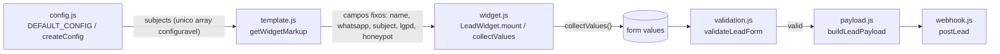

# SPEC: lead-form-configurable-fields

## Metadata
- Source: developer description via /plan
- Service: whatsapp-tray (client-side widget, IIFE bundle)
- Tier: standard
- Version: 1.1
- Architecture references: AGENTS.md, docs/agents/architecture.md, docs/agents/domain_rules.md

## Context
O widget expõe hoje um formulário de lead com campo fixo (`src/ui/template.js:getWidgetMarkup`): Nome completo, WhatsApp, Assunto (condicional a contexto produto/global), aceite LGPD e honeypot anti-bot. A ordem e o conjunto de campos são hardcoded no template HTML; não existe mecanismo de configuração de campos em `src/config.js` (`DEFAULT_CONFIG`/`createConfig`), que hoje só expõe valores escalares (cores, textos, seletores, `subjects`) — nenhum deles controla presença/ordem de campos de formulário.

A feature pede: (1) três novos campos de captura — CNPJ, Razão Social, E-mail; (2) uma opção de config `fields: string[]` que decide quais desses campos (mais os já existentes Nome/WhatsApp) aparecem e em que ordem; (3) uma sintaxe de prefixo `"*"` no item do array para marcar obrigatoriedade em validação de submit; (4) Nome completo e WhatsApp continuam sempre obrigatórios e sempre renderizados, independentemente do array configurado.

Arquitetura consultada: `docs/agents/architecture.md` — camada `core/` (regras puras, sem DOM/rede) não pode importar DOM; camada `ui/` (`src/ui/widget.js`, `src/ui/template.js`) é a única autorizada a tocar DOM e orquestrar submit; `config.js` só fornece defaults/merge (`createConfig`), nunca comportamento. `docs/agents/domain_rules.md` documenta que a validação de submit já segue uma ordem fixa (`honeypot → nome → whatsapp → lgpd → assunto`) em `src/core/validation.js:validateLeadForm` e que o payload do webhook usa chaves `snake_case` em português (`nome`, `whatsapp`, `origem_trafego`, `assunto`, `produto_interesse`, `produto_id` — `src/core/payload.js:buildLeadPayload`, verified at src/core/payload.js:12-29). Regra de camadas aplicada nesta SPEC: a resolução de quais campos renderizar/validar/enviar é regra de domínio → pertence a `src/core/` (ex.: um novo `core/fields.js` puro), não a `src/ui/widget.js` diretamente.

## AS IS — Estado atual

O conjunto e a ordem dos campos do formulário são fixos no template HTML (`src/ui/template.js`); `config.js` não possui nenhuma opção que controle presença/ordem/obrigatoriedade de campos. Apenas `subjects` (lista de assuntos do `<select>`) é parametrizável hoje.

## TO BE — Estado proposto

```mermaid
flowchart LR
  Config["config.js<br/>DEFAULT_CONFIG.fields (novo)"] -->|"fields: string[] (RF-01, CT-01)"| Resolver["core/fields.js<br/>resolveFields() (novo, RF-02..RF-07)"]
  Resolver -->|"lista ordenada + flags required"| Template["template.js<br/>getWidgetMarkup (alterado, UI-01)"]
  Template -->|"name, whatsapp sempre<br/>+ cnpj/razaoSocial/email conforme fields"| Widget["widget.js<br/>LeadWidget.mount / collectValues (alterado)"]
  Widget -->|"collectValues() (alterado)"| Values[("form values<br/>+cnpj/razaoSocial/email (novo)")]
  Values --> Validation["validation.js<br/>validateLeadForm (alterado, RF-08)"]
  Validation -->|valid| Payload["payload.js<br/>buildLeadPayload (alterado, RF-09/RF-10, CT-02)"]
  Payload --> Webhook["webhook.js<br/>postLead"]
```

`config.fields` (novo) alimenta uma resolução de domínio (`RF-01` a `RF-07`) que decide quais campos o `template.js` renderiza e em que ordem (`UI-01`); o mesmo resultado orienta `validateLeadForm` a reprovar submits com campos obrigatórios vazios (`RF-08`) e `buildLeadPayload` a incluir/omitir as chaves `cnpj`/`razao_social`/`email` no payload do webhook (`RF-09`, `RF-10`, `CT-02`).

## Scope
- **In**: novos campos de captura CNPJ, Razão Social, E-mail no formulário; config `fields: string[]` controlando presença e ordem desses campos e dos campos já existentes `name`/`whatsapp`; sintaxe de prefixo `"*"` para obrigatoriedade em validação de submit; Nome completo e WhatsApp permanecem sempre obrigatórios e sempre presentes; inclusão/omissão condicional dessas 3 chaves no payload do webhook.
- **Out**: validação de formato dos novos campos (regex/checksum de CNPJ, formato de e-mail) — não solicitada pelos ACs, apenas checagem de vazio para campos marcados com `*`; campos `subject`, `lgpd`, `honeypot` **não** entram no escopo de `config.fields` (permanecem regidos pelas regras existentes em `domain_rules.md` — assunto condicional a contexto, LGPD sempre obrigatório, honeypot sempre oculto) — ver marcador de esclarecimento abaixo; comportamento para identificadores desconhecidos em `fields` (string não reconhecida) — sugestão: ignorar silenciosamente, não é um AC; máscara/formatação de input para CNPJ (padrão `phone.js` de formatação ao digitar não é solicitado para os novos campos).

## RIGID (Non-Negotiable)

### Functional Requirements

- RF-01 [Event-Driven]: WHEN `LeadWidget.mount()` executa, o sistema SHALL resolver a lista ordenada de campos do formulário a partir de `config.fields` (array de strings), preservando a ordem dos índices do array como ordem de exibição, EXCETO para os identificadores `"name"` e `"whatsapp"`, cuja posição de renderização é sempre fixa nas duas primeiras posições (RF-08), independentemente de estarem presentes em `config.fields` e independentemente da posição em que apareçam no array.
  - AC: dado `config.fields = ["email", "cnpj"]`, o campo E-mail SHALL renderizar antes do campo CNPJ no DOM.
  - AC: dado `config.fields = ["email", "whatsapp", "cnpj"]`, WhatsApp SHALL renderizar na 2ª posição do formulário (não entre E-mail e CNPJ), e a ordem relativa entre E-mail e CNPJ SHALL ser preservada conforme o array.

- RF-02 [Optional/State-Driven]: WHERE `config.fields` contém o identificador `"cnpj"` (com ou sem prefixo `"*"`), o sistema SHALL renderizar o campo de entrada CNPJ no formulário.
  - AC: `config.fields = ["cnpj"]` resulta em `form.elements.cnpj` presente no DOM após `mount()`.

- RF-03 [Optional/State-Driven]: WHERE `config.fields` contém o identificador `"razaoSocial"` (com ou sem prefixo `"*"`), o sistema SHALL renderizar o campo de entrada Razão Social no formulário.
  - AC: `config.fields = ["razaoSocial"]` resulta em `form.elements.razaoSocial` presente no DOM após `mount()`.

- RF-04 [Optional/State-Driven]: WHERE `config.fields` contém o identificador `"email"` (com ou sem prefixo `"*"`), o sistema SHALL renderizar o campo de entrada E-mail no formulário.
  - AC: `config.fields = ["email"]` resulta em `form.elements.email` presente no DOM após `mount()`.

- RF-05 [Unwanted/Conditional]: IF `config.fields` omite `"cnpj"`, `"razaoSocial"` ou `"email"` (com ou sem prefixo), THEN o sistema SHALL NOT renderizar o campo de entrada correspondente.
  - AC: `config.fields = ["email"]` resulta em `form.elements.cnpj` e `form.elements.razaoSocial` ausentes (`undefined`) do DOM.

- RF-06 [Event-Driven]: WHEN um item de `config.fields` inicia com o caractere `"*"` (ex.: `"*cnpj"`), o sistema SHALL tratar o campo referenciado (identificador após remover o prefixo) como obrigatório para submissão.
  - AC: `config.fields = ["*cnpj"]` faz `form.elements.cnpj` renderizar e ser exigido; submit com CNPJ vazio reprova.

- RF-07 [State-Driven]: WHILE um item de `config.fields` referencia `"cnpj"`, `"razaoSocial"` ou `"email"` sem o prefixo `"*"`, o sistema SHALL tratar o campo como opcional para submissão (submit não reprova por ele estar vazio).
  - AC: `config.fields = ["cnpj"]` (sem `*`) permite submit válido com CNPJ vazio, dado que os demais campos obrigatórios estejam preenchidos.

- RF-08 [Event-Driven]: WHEN `LeadWidget.mount()` executa, o sistema SHALL sempre renderizar os campos "Nome completo" e "WhatsApp" nas duas primeiras posições do formulário, nesta ordem (Nome antes de WhatsApp), e SHALL sempre tratá-los como obrigatórios para submissão — independentemente de estarem presentes em `config.fields`, independentemente de carregarem o prefixo `"*"` e independentemente da posição em que apareçam no array, caso incluídos.
  - AC: com `config.fields = []` (ou omitindo `name`/`whatsapp`), `form.elements.name` e `form.elements.whatsapp` SHALL estar presentes no DOM, nesta ordem, nas duas primeiras posições, e submit com qualquer um deles vazio SHALL reprovar.
  - AC: com `config.fields = ["email", "whatsapp"]`, WhatsApp SHALL renderizar na 2ª posição (não na posição que ocupa no array).

- RF-09 [Unwanted]: IF o formulário é submetido (`LeadWidget.submit()`) E algum campo tratado como obrigatório (via RF-06 ou RF-08) está vazio ou contém apenas espaços em branco após `.trim()`, THEN o sistema SHALL NOT prosseguir com a submissão (sem chamada a `postLead`, sem `buildWhatsappUrl`/redirecionamento) E SHALL exibir mensagem de erro associada ao campo, seguindo o padrão de retorno `{ valid, bot, errors }` de `src/core/validation.js:validateLeadForm` (verified at src/core/validation.js:9-43).
  - AC: `config.fields = ["*email"]` com campo E-mail vazio no submit resulta em `validation.valid === false` e `validation.errors.email` definido; nenhuma chamada de rede ao webhook ocorre.

- RF-10 [Event-Driven]: WHEN a validação de submissão passa (`validation.valid === true`), o sistema SHALL incluir no payload enviado ao webhook (`buildLeadPayload`) uma chave para cada campo de `config.fields` presente no formulário, usando as chaves `cnpj`, `razao_social` e `email` respectivamente (nomenclatura `snake_case` em português consistente com as chaves existentes `nome`/`whatsapp`/`origem_trafego`, verified at src/core/payload.js:12-29), com o valor de texto informado após `.trim()`.
  - AC: `config.fields = ["cnpj", "email"]` preenchidos no submit resulta em payload contendo `payload.cnpj` e `payload.email` com os valores digitados; `payload.razao_social` ausente.

- RF-11 [Unwanted]: IF um campo (`cnpj`, `razaoSocial`, `email`) não está presente em `config.fields`, THEN o sistema SHALL NOT incluir a chave correspondente (`cnpj`/`razao_social`/`email`) no payload enviado ao webhook.
  - AC: `config.fields = ["cnpj"]` resulta em payload sem as chaves `razao_social` e `email`.

### UI Requirements

- UI-01 [Event-Driven]: WHEN `LeadWidget.mount()` renderiza o formulário, o sistema SHALL envolver cada campo configurado (`cnpj`, `razaoSocial`, `email`) em um elemento `<label>` com texto visível ("CNPJ", "Razão Social", "E-mail" respectivamente) associado ao `<input>` correspondente, seguindo o padrão estrutural existente (`<label>Texto<input name="..."/></label>`, verified at src/ui/template.js:31-38).
  - AC: inspeção do DOM mostra `label.textContent` contendo o rótulo esperado e `label` contendo o `input` do campo correspondente.

- UI-02 [Event-Driven]: WHEN `config.fields` reordena os campos, o sistema SHALL refletir a nova ordem na sequência de elementos filhos do formulário (`.wpp-lead-form`), mantendo os campos `subject`/`lgpd`/`honeypot` fixos após o bloco de campos configuráveis (posição inalterada em relação ao AS IS).
  - AC: para `config.fields = ["email", "*cnpj"]`, a ordem de `form.querySelectorAll('label, input')` reflete Nome, WhatsApp (sempre 1ª e 2ª posições, RF-08), E-mail, CNPJ, seguidos de Assunto/LGPD/honeypot.

### Contracts

- CT-01: Config `fields` — novo campo em `DEFAULT_CONFIG`/`createConfig` (`src/config.js`): `fields: string[]`, onde cada item é um identificador de campo (`"name"`, `"whatsapp"`, `"cnpj"`, `"razaoSocial"`, `"email"`) opcionalmente prefixado com `"*"` para marcar obrigatoriedade. `DEFAULT_CONFIG.fields` SHALL ser `[]` quando o merchant não define a opção (comportamento atual preservado: apenas Nome e WhatsApp aparecem; CNPJ/Razão Social/E-mail só aparecem se explicitamente incluídos). Convenção `camelCase` para identificadores multi-palavra, consistente com as demais chaves de `DEFAULT_CONFIG` (`webhookTimeoutMs`, `honeypotName`, `productSubjectValue` — verified at src/config.js:3-24).
- CT-02: Payload webhook (outbound, `postLead`) — adiciona chaves opcionais `cnpj`, `razao_social`, `email` (strings) ao JSON documentado em `docs/agents/api_contracts.md`, presentes se e somente se o respectivo campo constar em `config.fields`; convenção `snake_case` português consistente com `origem_trafego`/`url_origem`/`produto_interesse` (verified at src/core/payload.js:12-29).

### Non-Functional Requirements

- RNF-01: A feature SHALL NOT adicionar nenhuma dependência de runtime em `package.json` (`dependencies` permanece vazio) — regra de arquitetura (AGENTS.md: "Never add a runtime dependency casually").
- RNF-02: A resolução de campos a partir de `config.fields` e a renderização subsequente SHALL ocorrer de forma síncrona dentro de `LeadWidget.mount()`, sem novas chamadas de rede (0 requests adicionais além do fluxo de submit já existente).

## FLEXIBLE (Implementation Suggestions)
- Nova função pura `src/core/fields.js:resolveFields(fieldsConfig)` retornando `[{ id, required }]` ordenado, chamada tanto por `template.js` (render) quanto por `validation.js`/`payload.js` (validação/payload) — evita duplicar o parsing do prefixo `"*"` em múltiplos módulos.
- `DEFAULT_CONFIG.fields` é `[]` (array vazio), conforme CT-01.
- Reaproveitar o padrão `<label>Texto<input name="..." /></label>` de `src/ui/template.js` para os 3 novos campos, sem criar novo helper de template.
- Mensagens de erro sugeridas para os novos campos obrigatórios: `'Informe o CNPJ.'`, `'Informe a razão social.'`, `'Informe um e-mail.'` — seguindo o tom direto das mensagens existentes em `src/core/validation.js`.

## Acceptance Criteria Summary
| ID | Criterion | Testable? |
|----|-----------|-----------|
| AC1 | Formulário ganha campos CNPJ, Razão Social, E-mail (RF-02, RF-03, RF-04, UI-01) | Sim |
| AC2 | `config.fields` controla quais campos aparecem e a ordem (RF-01, RF-05, UI-02) | Sim |
| AC3 | Prefixo `"*"` marca obrigatoriedade; submit reprova se vazio (RF-06, RF-09) | Sim |
| AC4 | Nome completo e WhatsApp sempre obrigatórios e sempre presentes (RF-08) | Sim |
| AC5 | Demais campos opcionais por padrão sem `"*"` (RF-07) | Sim |
| — | Payload webhook inclui/omite `cnpj`/`razao_social`/`email` conforme config (RF-10, RF-11, CT-02) | Sim |

## Resolved Decisions
- Escopo de `config.fields` (confirmado): o array controla apenas os campos de captura de dados `name`, `whatsapp`, `cnpj`, `razaoSocial`, `email`. Os campos `subject`, `lgpd` e `honeypot` **não** entram no array `fields` e mantêm suas regras atuais (assunto com obrigatoriedade condicional conforme `domain_rules.md`, LGPD sempre obrigatório, honeypot sempre oculto).
- Posição de `name`/`whatsapp` (confirmado): renderizam SEMPRE nas duas primeiras posições do formulário, nesta ordem (Nome, depois WhatsApp), independentemente de estarem presentes ou ausentes em `config.fields` e independentemente da posição em que apareçam no array (ex.: `config.fields` incluindo `"whatsapp"` no meio do array não move sua posição de renderização — ver RF-01, RF-08).
- Default de `config.fields` (confirmado): `[]` quando o merchant não configura nada. Nesse caso o formulário preserva o comportamento atual (apenas Nome + WhatsApp); CNPJ, Razão Social e E-mail só aparecem se explicitamente incluídos no array (ver CT-01).
