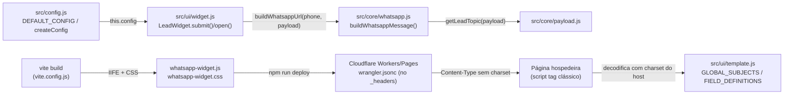
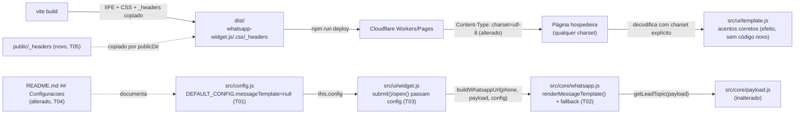

# Implementation Plan

## Request Summary
- Objective: (1) let merchants override the WhatsApp redirect message via `config.messageTemplate` with placeholder substitution, falling back byte-identically to the current hardcoded template; (2) force `charset=utf-8` on the `Content-Type` of `whatsapp-widget.js`/`.css` so accented UI text never depends on the host page's declared charset.
- Scope: in — `config.messageTemplate` option, `{placeholder}` substitution over the lead payload (+ `{topico}` alias), fallback/type-safety per RF-02/RF-05, README docs, self-contained charset fix at the widget's own asset-delivery layer. Out — new lead-capture fields, template conditionals/loops, i18n, webhook payload/contract changes.
- Tier: standard
- Architecture references: AGENTS.md, docs/agents/architecture.md, docs/agents/domain_rules.md, docs/agents/coding_guidelines.md, docs/agents/tech_stack.md

## AS IS — Componentes impactados



Legenda: à esquerda, `LeadWidget` chama `buildWhatsappUrl`→`buildWhatsappMessage` com um template fixo sem hook de configuração; `config.js` não expõe nenhuma chave de template. À direita, o pipeline de build/deploy não declara `charset` nos assets publicados, deixando a decodificação a cargo da página hospedeira.

## TO BE — Componentes propostos



Legenda: `T01` adiciona `messageTemplate` a `DEFAULT_CONFIG`; `T02` implementa a substituição de placeholders em `whatsapp.js` com fallback byte-idêntico; `T03` propaga `this.config` para `buildWhatsappUrl` nos dois pontos de chamada (`open()`/`disableForm`, `submit()`); `T04` documenta a opção no README; `T05` cria `public/_headers`, copiado pelo `publicDir` padrão do Vite para o bundle publicado, forçando `charset=utf-8` sem exigir nada da página hospedeira.

## Tasks

### T01 — Adicionar `messageTemplate` à configuração
- **Files**: `src/config.js`
- **Change**: adicionar `messageTemplate: null` a `DEFAULT_CONFIG` (chave opcional, default `null`, sem alterar `createConfig` — o merge spread já propaga overrides). Mantém o padrão "single merge factory" (`docs/agents/coding_guidelines.md` §4).
- **Covers**: CT-01
- **Tests**: `tests/unit/config.test.js` — novo `describe('config messageTemplate default')`: `DEFAULT_CONFIG.messageTemplate` é `null`; `createConfig({ messageTemplate: 'Ola {nome}' }).messageTemplate` reflete o override.
- **Risk**: Low — chave nova aditiva, nenhum consumidor existente lê `config.messageTemplate` ainda.
- **Dependencies**: none

### T02 — Implementar substituição de placeholders em `buildWhatsappMessage`
- **Files**: `src/core/whatsapp.js`
- **Change**: adicionar função pura `renderMessageTemplate(template, payload)` usando `/\{(\w+)\}/g`: para cada `{campo}`, resolve `campo === 'topico' ? getLeadTopic(payload) : (payload[campo] ?? '')`, sempre string (RF-04). Estender `buildWhatsappMessage(payload, config = {})` e `buildWhatsappUrl(phoneNumber, payload, config = {})` (novo 2º/3º parâmetro com default `{}`, retrocompatível com chamadas de 1/2 argumentos): SE `typeof config.messageTemplate === 'string' && config.messageTemplate.trim() !== ''` (RF-01), usar `renderMessageTemplate`; SENÃO (ausente, `null`, vazio após trim, ou tipo não-string — RF-02/RF-05) manter exatamente a lógica atual de `buildWhatsappMessage` sem alterar seu texto/branching. Mantém a função pura, sem DOM/rede (`docs/agents/coding_guidelines.md` §1).
  - Simplificação em relação à sugestão FLEXIBLE do SPEC: sem parâmetro `extraFields` separado — `buildLeadPayload` (`src/core/payload.js:29-31`) já grava os campos extras (`cnpj`, `razao_social`, `email`) diretamente no payload sob `FIELD_DEFINITIONS[id].payloadKey`; a resolução genérica `payload[campo]` cobre RF-03 sem `whatsapp.js` importar `FIELD_DEFINITIONS`.
- **Covers**: RF-01, RF-02, RF-03, RF-04, RF-05, RNF-02
- **Tests**: `tests/unit/whatsapp.test.js` — manter as 2 asserções existentes intactas (RNF-02 regressão); adicionar casos: (a) `messageTemplate: 'Ola {nome}, sobre {topico}'` + payload `{nome:'Joao', assunto:'Pedidos'}` → `'Ola Joao, sobre Pedidos'` (RF-01/RF-03); (b) sem `messageTemplate` → string idêntica ao branch atual, com/sem `nome` (RF-02); (c) `messageTemplate: 'CNPJ: {cnpj}'` + payload com `cnpj` → contém valor (RF-03, campo extra); (d) `messageTemplate: 'Ola {nome_do_meio}!'` sem a chave no payload → `'Ola !'`, sem exceção, e `buildWhatsappUrl` retorna URL `wa.me` válida e `decodeURIComponent`-reversível (RF-04); (e) `messageTemplate: 123` → mesma saída que sem template (RF-05).
- **Risk**: Medium — muda a assinatura de duas funções `core/` consumidas por `src/ui/widget.js`; mitigado por parâmetro opcional com default `{}` (chamadas existentes de 1/2 args continuam válidas) e pela suíte de regressão RNF-02.
- **Dependencies**: none (paralelo a T01; usa a chave `config.messageTemplate` já definida contratualmente por CT-01/RF-01, mas não depende do merge de T01 para compilar/testar)

### T03 — Propagar `config` para `buildWhatsappUrl` no widget
- **Files**: `src/ui/widget.js`
- **Change**: nos dois pontos de chamada existentes — `open()` linha 98 (`disableForm: true`) e `submit()` linha 197 — trocar `buildWhatsappUrl(this.config.phoneNumber, payload)` por `buildWhatsappUrl(this.config.phoneNumber, payload, this.config)`. Nenhuma outra mudança de orquestração (mantém `docs/agents/architecture.md` — `ui/` chama `core/`, não duplica regra de negócio).
- **Covers**: RF-01 (cobertura do "ou `open()` em modo `disableForm`")
- **Tests**: `tests/integration/global-widget.spec.js` e `tests/integration/disable-form.spec.js` continuam passando sem alteração (regressão, RNF-02 em nível de widget); não é necessário novo teste de integração — a lógica de substituição já é coberta unitariamente em T02 e a wiring é uma passagem de parâmetro de 1 linha por call site.
- **Risk**: Low — passagem de parâmetro adicional, sem novo branching.
- **Dependencies**: T02 (consome a nova assinatura de `buildWhatsappUrl`)

### T04 — Documentar `messageTemplate` no README
- **Files**: `README.md`
- **Change**: na seção `## Configuracoes` (linha 48), adicionar item `messageTemplate` documentando: tipo (string opcional), fallback ao template padrão quando ausente/vazio/tipo inválido, lista completa dos placeholders de RF-03 (`{nome}`, `{whatsapp}`, `{origem_trafego}`, `{url_origem}`, `{data_hora}`, `{assunto}`, `{produto_interesse}`, `{produto_id}`, `{topico}`, mais os placeholders por campo extra configurado — `{cnpj}`, `{razao_social}`, `{email}`, nomeados pelo `payloadKey`, não pelo id de `config.fields`), comportamento de placeholder sem valor (string vazia, RF-04), e um bloco de exemplo com template customizado + um exemplo do fallback.
- **Covers**: RF-08
- **Tests**: não aplicável (documentação); verificação manual — `grep -c 'messageTemplate' README.md` > 0 dentro de `## Configuracoes` e presença de todos os placeholders de RF-03.
- **Risk**: Low — apenas texto.
- **Dependencies**: none

### T05 — Forçar `charset=utf-8` nos assets do widget
- **Files**: `public/_headers` (novo diretório/arquivo)
- **Change**: criar `public/_headers` com regras para os dois assets publicados:
  ```
  /whatsapp-widget.js
    Content-Type: text/javascript; charset=utf-8

  /whatsapp-widget.css
    Content-Type: text/css; charset=utf-8
  ```
  `vite.config.js` não define `publicDir` (default `'public'`), então o Vite copia `public/_headers` verbatim para a raiz do `dist/` a cada `vite build`; Cloudflare Workers/Pages Static Assets honra um `_headers` na raiz do diretório de assets publicado. Correção autocontida — nenhuma alteração em `index.html`/`snippet.html` do site consumidor (RF-07).
- **Covers**: RF-06, RF-07, CT-02, RNF-03
- **Tests**: sem teste automatizado no repo (Playwright roda contra `npm run dev`, que não reproduz o pipeline de assets estáticos do Workers — ver Open Questions). Verificação equivalente à AC de RF-06/RNF-03: `npm run build && npm run preview` (`wrangler dev` sobre o `dist/` real) seguido de `curl -I http://127.0.0.1:<porta>/whatsapp-widget.js` e `/whatsapp-widget.css` confirmando `Content-Type` com `charset=utf-8`; repetir contra a URL de deploy após `npm run deploy` (AC literal de RF-06).
- **Risk**: Medium — depende de `_headers` ser honrado pela versão específica de `wrangler`/Workers Static Assets deste projeto [UNVERIFIED]; se não for, o fallback é `assets.headers` em `wrangler.jsonc` (mencionado como alternativa no SPEC FLEXIBLE). Rollback trivial (arquivo aditivo único).
- **Dependencies**: none

## Execution Phases
| Phase | Tasks | Parallel-safe? |
|-------|-------|----------------|
| 1 | T01, T02, T04, T05 | Yes — arquivos distintos, sem interface compartilhada em uso; T02 define uma assinatura nova que só T03 consome |
| 2 | T03 | No — depende da assinatura de `buildWhatsappUrl`/`buildWhatsappMessage` produzida em T02 |

## Contracts emitted
| Artifact | Path | RFs covered | Compatibility |
|---|---|---|---|
| OpenAPI 3.1 (static asset headers) | `.spec/features/whatsapp-message-template-charset-fix/openapi.yaml` | RF-06, RF-07, RNF-03 (CT-02) | New — nenhum `openapi.yaml`/`*.proto`/`asyncapi.yaml` pré-existente no repo (`docs/agents/api_contracts.md` confirma "No routes... exist in this repo"); artifact é documentação do contrato de header de resposta, não uma API de negócio nova |

CT-01 (`config.messageTemplate?: string`) não gera artifact de contrato — é uma chave de configuração interna de função JS, não uma interface de rede (REST/gRPC/async); está coberta inline na Task T01 e no schema de `DEFAULT_CONFIG`.

## Risks
| Risk | Blast radius | Mitigation | Rollback |
|------|-------------|------------|----------|
| Mudança de assinatura de `buildWhatsappMessage`/`buildWhatsappUrl` (T02) quebra alguma chamada não mapeada | `src/core/whatsapp.js`, `src/ui/widget.js`, qualquer teste que invoque essas funções | Parâmetro `config = {}` com default, retrocompatível com chamadas de aridade menor; suíte de regressão RNF-02 roda antes de mesclar | `git revert` das 2 files (whatsapp.js, widget.js) |
| `public/_headers` não é honrado pela pilha Cloudflare Workers Static Assets deste projeto (versão do `wrangler`/plugin) | RF-06/RF-07/CT-02/RNF-03 não atendidos em produção — mojibake persiste para hosts que não declaram UTF-8 | Verificação local via `npm run preview` + `curl -I` antes do deploy (task T05); fallback documentado para `assets.headers` em `wrangler.jsonc` | Remover `public/_headers` (arquivo aditivo único, sem efeito colateral) |
| Regex `/\{(\w+)\}/g` casa acidentalmente com texto do lojista que não é um placeholder intencional (ex.: `{}` vazio, ou `\w+` que colide com um nome de campo) | Mensagem final do WhatsApp para merchants com `messageTemplate` customizado | RF-04 garante substituição por string vazia sem exceção; comportamento documentado no README (T04) | N/A — comportamento é o contratado pelo RIGID, não um bug |

## Open Questions
- [UNVERIFIED] `public/_headers` é honrado pelo pipeline de deploy real (`@cloudflare/vite-plugin` `^1.33.1` + `wrangler` `^4.84.1`, sem `assets.directory` explícito em `wrangler.jsonc`) da mesma forma que em Cloudflare Pages clássico? Impacto: se não for, RF-06/CT-02/RNF-03 ficam não atendidos apesar do código estar "correto" — mitigado por verificação manual pré-deploy prescrita em T05, mas idealmente confirmado pelo executor via `npm run preview` antes de considerar a task concluída.
- README RF-08 pede "lista completa de placeholders" — deve incluir os identificadores de `config.fields` (`cnpj`, `razaoSocial`, `email`) ou os `payloadKey` correspondentes usados no template (`cnpj`, `razao_social`, `email`)? Plano assume `payloadKey` (é o que o payload realmente expõe e o que `renderMessageTemplate` resolve); impacto se errado: usuário tenta `{razaoSocial}` no template e recebe string vazia silenciosa (RF-04 mascara o erro de digitação).

## Assumptions
- `buildWhatsappMessage(payload, config = {})` e `buildWhatsappUrl(phoneNumber, payload, config = {})` ganham um parâmetro `config` adicional com default `{}` — o texto do AC de RF-01 (`buildWhatsappMessage(payload)`) é lido como forma abreviada, não assinatura literal; um `messageTemplate` como estado de módulo violaria a regra de funções puras sem estado (`docs/agents/coding_guidelines.md` §1) e o próprio CT-01 ("consumida somente por `buildWhatsappMessage`") implica passagem explícita de config, não leitura de global.
- `renderMessageTemplate(template, payload)` dispensa um parâmetro `extraFields` (sugerido como FLEXIBLE no SPEC) porque `buildLeadPayload` já materializa os campos extras no payload sob seus `payloadKey` — verificado em `src/core/payload.js:29-31`.
- Nenhum teste Playwright novo é adicionado para UI-01 (charset) porque `playwright.config.js` roda contra `npm run dev` (servidor Vite dev, ESM), que não reproduz o pipeline de assets estáticos/`_headers` do Cloudflare Workers usado em produção — a verificação real exige `wrangler dev`/deploy real, conforme a própria AC de RF-06 (`curl -I` contra a URL de deploy).
