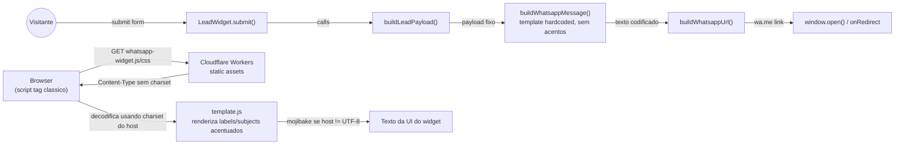
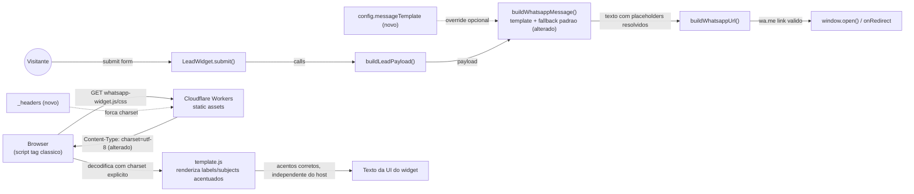

# SPEC: whatsapp-message-template-charset-fix

## Metadata
- Source: developer description via /plan
- Service: whatsapp-lead (widget, single repo)
- Tier: standard
- Version: 1.0
- Architecture references: AGENTS.md, docs/agents/architecture.md, docs/agents/domain_rules.md

## Context
O widget hoje monta a mensagem de redirecionamento ao WhatsApp com um template fixo, hardcoded em `buildWhatsappMessage` (`src/core/whatsapp.js:4-10`) — sem accent marks (`Ola!`, `Podem me ajudar?`), sem possibilidade de customização pelo lojista. `createConfig`/`DEFAULT_CONFIG` (`src/config.js:3-32`) não expõe nenhuma opção de template; o único ponto de configuração de conteúdo textual hoje é `subjects` (lista de assuntos).

Paralelamente, textos fixos acentuados da UI (`Dúvida técnica`, `Razão Social`, `Informe um e-mail válido.`) vivem em `src/config.js:1` (`GLOBAL_SUBJECTS`) e `src/core/fields.js:8,10,15` (`FIELD_DEFINITIONS` labels/mensagens de erro), injetados no HTML do painel via `src/ui/template.js` (`getWidgetMarkup`). O widget é distribuído como `<script src="...whatsapp-widget.js">` clássico (não `type="module"`) via CDN Cloudflare Workers/Pages (README.md:11-14, `wrangler.jsonc`). Não existe arquivo `_headers` no repositório (`find` sem resultado) — o asset é servido sem `charset` explícito no header `Content-Type`. Pela especificação HTML de "fetch a classic script", a codificação de um `<script>` sem atributo `charset` e sem `charset` no `Content-Type` da resposta HTTP recai para a codificação do documento hospedeiro; se a página host não declarar `UTF-8` (ou declarar outra), os literais acentuados do bundle (codificado em UTF-8 pelo Vite) são decodificados incorretamente (mojibake) — causa raiz plausível de AC6/AC7, dado que a correção deve ser autocontida na entrega do widget.

`buildLeadPayload` (`src/core/payload.js:13-34`) produz as chaves `nome`, `whatsapp`, `origem_trafego`, `url_origem`, `data_hora`, e, conforme o contexto, `assunto` OU `produto_interesse`+`produto_id`, além de uma chave por campo extra configurado via `FIELD_DEFINITIONS[field.id].payloadKey` (`cnpj`, `razao_social`, `email`). `getLeadTopic(payload)` (`src/core/payload.js:36-38`) já resolve o "assunto efetivo" (`produto_interesse || assunto || ''`) independente do contexto — base natural para um placeholder unificado de tópico.

## AS IS — Estado atual

Legenda: à esquerda, a montagem da mensagem do WhatsApp usa um template fixo sem opção de customização. À direita, o script/CSS do widget é servido sem `charset` declarado no `Content-Type`; o navegador decodifica o bundle usando a codificação da página hospedeira, produzindo mojibake nos textos acentuados de `GLOBAL_SUBJECTS`/`FIELD_DEFINITIONS` quando o host não declara UTF-8.

## TO BE — Estado proposto

Legenda: `NEW_Config` (RF-01/RF-02/RF-03/RF-04/RF-05) permite customizar a mensagem via placeholders com fallback ao template atual. `NEW_Headers` (RF-06/RF-07/RNF-03) força `charset=utf-8` na resposta HTTP dos assets do widget, corrigindo a decodificação independente do charset da página hospedeira (UI-01).

## Scope
- **In**: opção de configuração `messageTemplate` (string) com substituição de placeholders baseados no payload do lead; fallback ao template atual quando ausente/invalido; comportamento definido para placeholder sem valor; documentação no README; correção de charset autocontida na entrega dos assets do widget (script/CSS).
- **Out**: novos campos de captura de dados do lead além dos já suportados por `config.fields`; lógica condicional/loops dentro do template (apenas substituição simples de placeholders); internacionalização/tradução do widget para outros idiomas; alteração do contrato do webhook (`src/integrations/webhook.js`) ou do payload enviado a ele.

## RIGID (Non-Negotiable)

### Functional Requirements
- RF-01 [Event-Driven]: WHEN `LeadWidget.submit()` (ou `open()` em modo `disableForm`) monta a mensagem final do WhatsApp, THE widget SHALL usar `config.messageTemplate`, quando fornecido como string não vazia, substituindo cada placeholder `{campo}` presente no template pelo valor correspondente do payload do lead antes de codificar a URL.
  - AC: com `messageTemplate: 'Ola {nome}, sobre {topico}'` e payload `{ nome: 'Joao', assunto: 'Pedidos' }`, `buildWhatsappMessage(payload)` retorna exatamente `'Ola Joao, sobre Pedidos'`.

- RF-02 [State-Driven]: WHILE `config.messageTemplate` não é fornecido (`undefined`, `null` ou string vazia após `.trim()`), THE widget SHALL usar a lógica padrão atual equivalente à existente em `buildWhatsappMessage` (`src/core/whatsapp.js:4-10`, verified at src/core/whatsapp.js:4), sem alterar seu texto ou branching (com/sem `nome`).
  - AC: chamando `buildWhatsappMessage(payload)` sem `messageTemplate` configurado, a string retornada é idêntica, byte a byte, à produzida pela implementação atual para o mesmo payload — coberto por `tests/unit/whatsapp.test.js` sem alteração das asserções pré-existentes.

- RF-03 [Event-Driven]: WHEN `messageTemplate` é processado, THE widget SHALL reconhecer os seguintes placeholders, mapeados 1:1 às chaves do payload construído por `buildLeadPayload` (`src/core/payload.js:13-34`, verified at src/core/payload.js:14-27) mais um alias calculado: `{nome}`, `{whatsapp}`, `{origem_trafego}`, `{url_origem}`, `{data_hora}`, `{assunto}`, `{produto_interesse}`, `{produto_id}`, `{topico}` (= `getLeadTopic(payload)`, verified at src/core/payload.js:36-38), e um placeholder por campo extra configurado em `config.fields` usando o respectivo `FIELD_DEFINITIONS[id].payloadKey` (`cnpj`, `razao_social`, `email`, verified at src/core/fields.js:2-17).
  - AC: com `config.fields: ['*cnpj']`, `messageTemplate: 'CNPJ: {cnpj}'` e payload contendo `cnpj: '12.345.678/0001-90'`, a mensagem final contém `'CNPJ: 12.345.678/0001-90'`.

- RF-04 [Unwanted Behavior]: IF um placeholder referenciado em `messageTemplate` não corresponde a nenhuma chave presente no payload (ausente, `undefined` ou string vazia), THEN THE widget SHALL substituí-lo por uma string vazia, mantendo a mensagem e a URL `wa.me` válidas — nunca deixar o literal `{campo}` no texto final nem lançar exceção.
  - AC: com `messageTemplate: 'Ola {nome_do_meio}!'` e payload sem a chave `nome_do_meio`, `buildWhatsappMessage(payload)` retorna `'Ola !'` (sem lançar erro) e `buildWhatsappUrl(phone, payload)` retorna uma URL `https://wa.me/...` válida e `decodeURIComponent`-reversível.

- RF-05 [Unwanted Behavior]: IF `config.messageTemplate` for fornecido com um tipo diferente de string (ex.: número, array, objeto), THEN THE widget SHALL tratá-lo como ausente e aplicar o fallback definido em RF-02, sem lançar exceção.
  - AC: com `messageTemplate: 123`, `buildWhatsappMessage(payload)` retorna o mesmo texto que retornaria sem `messageTemplate` configurado.

- RF-06 [Event-Driven]: WHEN o build de produção (`vite build`) gera os assets `whatsapp-widget.js` e `whatsapp-widget.css` para deploy no Cloudflare Workers/Pages (`wrangler.jsonc`, verified at wrangler.jsonc — sem `_headers` presente no repo), THE processo de deploy SHALL garantir que as respostas HTTP para esses dois arquivos incluam `charset=utf-8` no header `Content-Type`, independentemente do charset declarado (ou ausente) na página hospedeira.
  - AC: `curl -I https://whatsapp-lead.wisleyaguiar.workers.dev/whatsapp-widget.js` (verified at README.md:11-14) retorna header `Content-Type` contendo `charset=utf-8`; o mesmo vale para `/whatsapp-widget.css`.

- RF-07 [Unwanted Behavior]: THE correção de charset SHALL ser autocontida na entrega do widget (script/CSS/config de deploy do próprio repo) — IF a correção depender de o site hospedeiro adicionar/alterar seu próprio `<meta charset>` ou headers HTTP, THEN a implementação é considerada não conforme.
  - AC: nenhuma instrução de alteração de `<meta charset>` ou de headers do site hospedeiro é adicionada ao README como pré-requisito da correção; `index.html`/`snippet.html` do site consumidor não precisam de alteração para o fix funcionar.

- RF-08 [Event-Driven]: WHEN a feature é entregue, THE `README.md`, seção `## Configuracoes` (verified at README.md:48), SHALL documentar a opção `messageTemplate`, a lista completa de placeholders disponíveis (RF-03) e ao menos um exemplo de uso com placeholder e fallback.
  - AC: `README.md` contém a string `messageTemplate` na seção `## Configuracoes`, lista todos os placeholders de RF-03 e um bloco de exemplo com template customizado.

### Contracts
- CT-01: `config.messageTemplate?: string` — nova chave opcional em `DEFAULT_CONFIG`/`createConfig` (`src/config.js:3-32`, verified — chave inexistente hoje); default `null`; consumida somente por `buildWhatsappMessage` (`src/core/whatsapp.js`), nunca por `src/ui/*`.
- CT-02: Contrato de resposta HTTP dos assets estáticos — `GET /whatsapp-widget.js` e `GET /whatsapp-widget.css` (domínio de deploy verified at README.md:11-14) DEVEM responder com `Content-Type` incluindo `charset=utf-8`.

### Non-Functional Requirements
- RNF-01: A implementação NÃO SHALL adicionar dependência de runtime — `package.json` (`dependencies.runtime` vazio hoje, verified — chave `dependencies` ausente do `package.json`, apenas `devDependencies`) permanece sem chave `dependencies` após a entrega, conforme AGENTS.md §2 ("Never add a runtime dependency casually — dependencies.runtime is empty; the widget is built and shipped as a dependency-free IIFE bundle").
- RNF-02: 100% das mensagens geradas sem `messageTemplate` configurado SHALL ser byte-idênticas à saída atual de `buildWhatsappMessage` para os mesmos payloads de entrada, validado pela suíte `tests/unit/whatsapp.test.js` sem regressão nas asserções existentes.
- RNF-03: 100% das respostas HTTP 200 para `whatsapp-widget.js` e `whatsapp-widget.css` SHALL declarar `charset=utf-8` no `Content-Type`, verificável via `curl -I` contra a URL de deploy pós-`npm run deploy`.

## FLEXIBLE (Implementation Suggestions)
- Implementar a substituição de placeholders com uma função pura em `src/core/whatsapp.js` (ex.: `renderMessageTemplate(template, payload, extraFields)`), reaproveitando `getLeadTopic` para `{topico}` — mantém a lógica em `core/` per `docs/agents/architecture.md` ("`core/` owns... payload/message shaping... framework-free functions").
- Regex simples `/\{(\w+)\}/g` para casar `{campo}`, sem parser de template.
- Correção de charset via arquivo `_headers` na pasta de assets publicada pelo Cloudflare Workers (compatível com Cloudflare Pages headers rules) ou via `assets.headers` no `wrangler.jsonc`, aplicando `Content-Type: text/javascript; charset=utf-8` a `/whatsapp-widget.js` e `Content-Type: text/css; charset=utf-8` a `/whatsapp-widget.css`.
- Novo teste de integração Playwright carregando o widget dentro de uma página host com `<meta charset="ISO-8859-1">` (ou sem meta charset) para cobrir UI-01 (`tests/integration/`, seguindo o padrão de `configurable-fields.spec.js`).
- Tabela de placeholders no README como lista `- {campo}: descrição`, junto ao bloco de exemplo já existente na seção `## Configuracoes`.

## Acceptance Criteria Summary
| ID | Criterion | Testable? |
|----|-----------|-----------|
| RF-01 | Placeholder substituído corretamente quando `messageTemplate` fornecido | Sim |
| RF-02 | Fallback ao template padrão quando `messageTemplate` ausente/vazio | Sim |
| RF-03 | Conjunto fixo de placeholders reconhecido (payload + campos extras) | Sim |
| RF-04 | Placeholder sem valor vira string vazia, sem quebrar mensagem/URL | Sim |
| RF-05 | `messageTemplate` de tipo inválido cai no fallback padrão | Sim |
| RF-06 | Assets do widget servidos com `charset=utf-8` no `Content-Type` | Sim |
| RF-07 | Correção não exige alteração no HTML/headers do site hospedeiro | Sim |
| RF-08 | README documenta opção, placeholders e exemplo | Sim |
| CT-01 | `messageTemplate` existe como chave opcional de config, default `null` | Sim |
| CT-02 | Contrato de header `Content-Type: charset=utf-8` nos assets | Sim |
| RNF-01 | Nenhuma dependência de runtime adicionada | Sim |
| RNF-02 | Saída padrão byte-idêntica ao comportamento atual sem template | Sim |
| RNF-03 | 100% das respostas dos assets com `charset=utf-8` | Sim |
